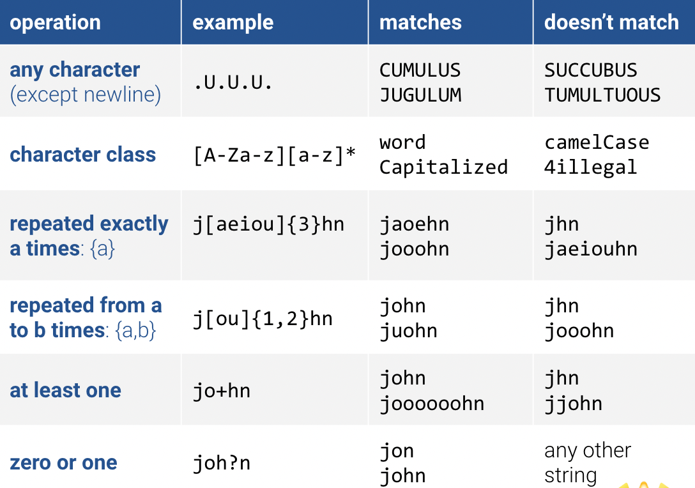
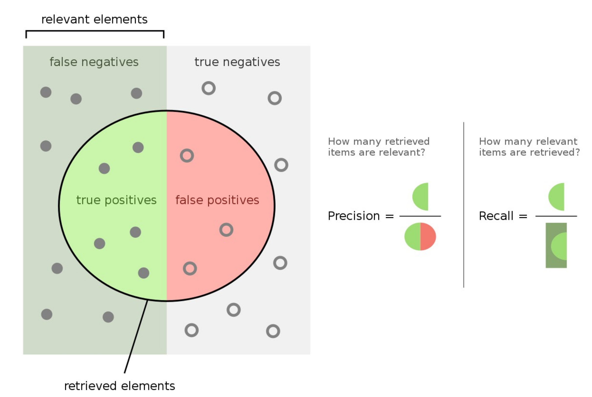

# Data 100: Principles and Techniques of Data Science

    University of California, Berkeley
    Instructors: Josh Hug
    j.hug@berkeley.edu
    Office Hours: TBD
    https://ds100.org/sp22
    Lecture: Tues/Thurs 3:30pm-5:00am 
    Zoom link TBD
    Author: Will Tholke

## Table of Contents

- [Data 100: Principles and Techniques of Data Science](#data-100-principles-and-techniques-of-data-science)
  - [Table of Contents](#table-of-contents)
  - [Lecture 1, 01/18/22 (Wk1): Course Overview](#lecture-1-011822-wk1-course-overview)
    - [Associated Reading](#associated-reading)
    - [The Data Science Lifecycle](#the-data-science-lifecycle)
  - [Lecture 2, 01/20/22 (Wk1): Data Sampling and Probability](#lecture-2-012022-wk1-data-sampling-and-probability)
    - [Censuses and Surveys](#censuses-and-surveys)
    - [Sampling](#sampling)
    - [Common Non-Random Samples](#common-non-random-samples)
    - [Common Biases](#common-biases)
    - [The Literary Digest & The 1936 Election](#the-literary-digest--the-1936-election)
    - [Probability Sample (aka Random Sample)](#probability-sample-aka-random-sample)
    - [Simple Random Sample](#simple-random-sample)
    - [Approximation for sampling](#approximation-for-sampling)
    - [Binomial and Multinomial Probabilities](#binomial-and-multinomial-probabilities)
    - [Extra: Permutations and Combinations](#extra-permutations-and-combinations)
      - [Permutations](#permutations)
      - [Combinations](#combinations)
    - [Example: The Binomial Coefficient](#example-the-binomial-coefficient)
  - [Lecture 3, 01/25/22 (Wk2): Pandas I](#lecture-3-012522-wk2-pandas-i)
    - [Resources](#resources)
    - [`Table` vs. `DataFrame`](#table-vs-dataframe)
    - [Indexing into DataFrames](#indexing-into-dataframes)
    - [Series](#series)
    - [Boolean Array Input and Alternatives](#boolean-array-input-and-alternatives)
    - [Some More Methods](#some-more-methods)
  - [Lecture 4, 01/27/22 (Wk2): Pandas II](#lecture-4-012722-wk2-pandas-ii)
    - [Example: Custom Sorts](#example-custom-sorts)
    - [Column Addition](#column-addition)
    - [Example: `Groupby.agg`](#example-groupbyagg)
    - [Example: `.filter()`](#example-filter)
    - [Example: `.pivot()`](#example-pivot)
  - [Lecture 5, 01/28/22 (Wk3): Data Cleaning, EDA](#lecture-5-012822-wk3-data-cleaning-eda)
    - [Data Wrangling](#data-wrangling)
    - [Exploratory Data Analysis (EDA)](#exploratory-data-analysis-eda)
      - [Some Context](#some-context)
    - [What should we look for? (there's a lot!)](#what-should-we-look-for-theres-a-lot)
      - [Structure](#structure)
      - [Granularity](#granularity)
      - [Scope](#scope)
      - [Temporality](#temporality)
      - [Faithfulness](#faithfulness)
      - [Missing Data & Input Values](#missing-data--input-values)
  - [Lecture 6, 01/30/22 (Wk3): Regular Expressions (Regex)](#lecture-6-013022-wk3-regular-expressions-regex)
    - [Resources](#resources-1)
      - [Python String Methods](#python-string-methods)
    - [What is a Regular Expression?](#what-is-a-regular-expression)
    - [Regex Syntax](#regex-syntax)
      - [Order of Operations](#order-of-operations)
      - [Expanded Regex Syntax](#expanded-regex-syntax)
      - [Convenient Regex](#convenient-regex)
      - [Even More Regex Features](#even-more-regex-features)
  - [Lecture 7, 02/8/22 (Wk4): Data Visualizations](#lecture-7-02822-wk4-data-visualizations)
    - [Resources](#resources-2)
    - [Goals of Data Visualization](#goals-of-data-visualization)
    - [Distributions](#distributions)
    - [Describing Distributions](#describing-distributions)
      - [Bar Plot](#bar-plot)
      - [Rugplot](#rugplot)
      - [Box Plot](#box-plot)
      - [Histogram](#histogram)
      - [Violin Plot](#violin-plot)
      - [Scatter Plot](#scatter-plot)
      - [Hex Plot](#hex-plot)
      - [Contour Plot](#contour-plot)
  - [Lecture 8, 02/10/22 (Wk4): Data Visualizations II](#lecture-8-021022-wk4-data-visualizations-ii)
    - [Kernel Density Estimation (KDE)](#kernel-density-estimation-kde)
    - [Creating KDEs](#creating-kdes)
    - [Summary of KDE](#summary-of-kde)
  - [Lecture 9, 02/15/22 (Wk5): Modeling and Simple Linear Regression](#lecture-9-021522-wk5-modeling-and-simple-linear-regression)
    - [Regression Line & Correlation](#regression-line--correlation)
    - [Parametric Models of Regression](#parametric-models-of-regression)
    - [The Modeling Process](#the-modeling-process)
    - [Loss Functions](#loss-functions)
    - [Minimizing MSE for the SLR Model](#minimizing-mse-for-the-slr-model)
    - [Evaluating Models](#evaluating-models)
  - [Lecture 10, 02/17/22 (Wk5): Constant Model, Loss, Transformations](#lecture-10-021722-wk5-constant-model-loss-transformations)
    - [Resources](#resources-3)
    - [Terminology & Notation](#terminology--notation)
    - [Minimizing MSE](#minimizing-mse)
    - [Terminology: Prediction vs. Estimation](#terminology-prediction-vs-estimation)
    - [The Constant Model](#the-constant-model)
    - [Fit the Model: Calculus for the General Case](#fit-the-model-calculus-for-the-general-case)
    - [Summary: Loss Optimization, Calculus, & Critical Points](#summary-loss-optimization-calculus--critical-points)
    - [Anscombe's quartet](#anscombes-quartet)
    - [Multiple Linear Regression](#multiple-linear-regression)
      - [Linear Algebra Representation](#linear-algebra-representation)
  - [Midterm 1 Review Session, 02/19/22 (Wk5):](#midterm-1-review-session-021922-wk5)
    - [Sampling](#sampling-1)
      - [Simple Random Sample](#simple-random-sample-1)
      - [Simple Random Sample w/ Replacement](#simple-random-sample-w-replacement)
      - [Stratified Random Sample](#stratified-random-sample)
      - [Quota Sampling](#quota-sampling)
      - [Convenience Sampling](#convenience-sampling)
      - [Selection Bias](#selection-bias)
      - [Response Bias](#response-bias)
      - [Non-response Bias](#non-response-bias)
      - [Census](#census)
    - [Probability](#probability)
    - [Types of Variables](#types-of-variables)
      - [Quantitative](#quantitative)
      - [Qualitative](#qualitative)
    - [Loss Functions & Linear Regression](#loss-functions--linear-regression)
      - [L1 Loss (Mean Absolute Loss) [MAS]](#l1-loss-mean-absolute-loss-mas)
      - [L2 Loss (Mean Squared Loss) [MSE]](#l2-loss-mean-squared-loss-mse)
  - [Lecture 11, 02/22/22 (Wk6): Ordinary Least Squares (Multiple Linear Regression)](#lecture-11-022222-wk6-ordinary-least-squares-multiple-linear-regression)
    - [Associated Readings](#associated-readings)
    - [Content Overview](#content-overview)
    - [Recap: Simple vs. Multiple Linear Regression](#recap-simple-vs-multiple-linear-regression)
  - [Lecture 12, 03/01/22 (Wk7): Gradient Descent, sklearn](#lecture-12-030122-wk7-gradient-descent-sklearn)
    - [Abstraction and Simplicity](#abstraction-and-simplicity)
    - [Minimization](#minimization)
    - [Gradient Descent](#gradient-descent)
  - [Lecture 13, 03/03/22 (Wk7): Feature Engineering](#lecture-13-030322-wk7-feature-engineering)
    - [Batch Gradient Descent](#batch-gradient-descent)
    - [Convexity](#convexity)
    - [Feature Engineering](#feature-engineering)
    - [Modeling Non-linear Relationships](#modeling-non-linear-relationships)
    - [One Hot Encoding](#one-hot-encoding)
    - [Lecture 14](#lecture-14)
  - [Lecture 14, 03/08/22 (Wk8): Case Study (HCE): Fairness in Housing Appraisal](#lecture-14-030822-wk8-case-study-hce-fairness-in-housing-appraisal)
  - [Lecture 15, 03/10/22 (Wk8): Cross Validation, Regularization](#lecture-15-031022-wk8-cross-validation-regularization)
    - [Associated Lecture Slides](#associated-lecture-slides)
    - [Review](#review)
    - [The Holdout Method](#the-holdout-method)
      - [Splitting Data with sklearn](#splitting-data-with-sklearn)
      - [Hyperparameters](#hyperparameters)
    - [K-Fold Cross Validation](#k-fold-cross-validation)
    - [Methods in sklearn](#methods-in-sklearn)
      - [K-Fold Cross Validation in sklearn](#k-fold-cross-validation-in-sklearn)
      - [The Holdout Method in sklearn](#the-holdout-method-in-sklearn)
    - [Test Sets](#test-sets)
    - [Ridge Regression](#ridge-regression)
  - [Lecture 16, 03/15/22 (Wk8): Random Variables](#lecture-16-031522-wk8-random-variables)
    - [Associated Lecture Slides](#associated-lecture-slides-1)
    - [Overview](#overview)
    - [Random Variable](#random-variable)
    - [Common Random Variables](#common-random-variables)
    - [Expectation and Variance](#expectation-and-variance)
    - [Sums of Random Variables](#sums-of-random-variables)
    - [Properties of Bernoulli Random Variables](#properties-of-bernoulli-random-variables)
    - [Sample Statistics](#sample-statistics)
    - [Central Limit Theorem](#central-limit-theorem)
  - [Lecture 17, 03/17/22 (Wk9): Estimators, Bias, and Variance](#lecture-17-031722-wk9-estimators-bias-and-variance)
    - [Associated Lecture Resources](#associated-lecture-resources)
    - [Square Root Law](#square-root-law)
    - [Prediction vs. Inference](#prediction-vs-inference)
    - [The Bias-Variance Tradeoff](#the-bias-variance-tradeoff)
    - [The Snowy Plover dataset [Important for HW 6]](#the-snowy-plover-dataset-important-for-hw-6)
    - [Review: Bootstrapping](#review-bootstrapping)
  - [Lecture 18, 03/29/22 (Wk10): SQL 1](#lecture-18-032922-wk10-sql-1)
    - [Associated Lecture Resources](#associated-lecture-resources-1)
    - [Brief Databases Overview](#brief-databases-overview)
    - [Summary of SQL Syntax from Today](#summary-of-sql-syntax-from-today)
    - [The Magic Comamnd](#the-magic-comamnd)
    - [SQL Terminology](#sql-terminology)
      - [Properties](#properties)
      - [Types](#types)
      - [Constraints](#constraints)
    - [SQL Keywords](#sql-keywords)
  - [Lecture 19, 03/31/22 (Wk10): SQL 2](#lecture-19-033122-wk10-sql-2)
    - [Downsides of `pd.read_sql()`](#downsides-of-pdread_sql)
    - [.tsv Files](#tsv-files)
    - [`LIKE`](#like)
    - [`CAST`](#cast)
    - [Joins](#joins)
    - [PCA](#pca)
    - [Matrix Decomposition Summary](#matrix-decomposition-summary)
  - [Lecture 20, 04/05/22 (Wk11): PCA II](#lecture-20-040522-wk11-pca-ii)
    - [Principal Component Analysis](#principal-component-analysis)
    - [Singular Value Decomposition](#singular-value-decomposition)
    - [Principal Component](#principal-component)
    - [Summary](#summary)
  - [Lecture 21 & 22, 04/12/22 & 04/14/22 (Wk12): Logistic Regression I & II](#lecture-21--22-041222--041422-wk12-logistic-regression-i--ii)
    - [The Modeling Process](#the-modeling-process-1)
    - [Deifning the Model](#deifning-the-model)
    - [Empirical Risk](#empirical-risk)
    - [Fitting and Predicting](#fitting-and-predicting)
    - [Precision and Recall](#precision-and-recall)
  - [Lecture 23, 04/19/22 (Wk13): Decision Trees](#lecture-23-041922-wk13-decision-trees)
    - [Context: Why decision trees? What about overfitting? Random forests?](#context-why-decision-trees-what-about-overfitting-random-forests)
    - [Math & Computation](#math--computation)
      - [Node Entropy](#node-entropy)
      - [Weighted Entropy](#weighted-entropy)
    - [Other Useful Notes](#other-useful-notes)
  - [Lecture 24, 04/21/22 (Wk13): Clustering](#lecture-24-042122-wk13-clustering)
    - [K-means Algorithm](#k-means-algorithm)
    - [Loss Functions for Clustering](#loss-functions-for-clustering)
    - [Agglomerative Clustering Algorithm](#agglomerative-clustering-algorithm)
    - [Hierarchies and Other Concepts](#hierarchies-and-other-concepts)
    - [Silhouette Scores](#silhouette-scores)
  - [Lecture 25, 04/26/22 (Wk14): Guest Speaker: Amol Deshpande - Data Regulations](#lecture-25-042622-wk14-guest-speaker-amol-deshpande---data-regulations)
  - [Lecture 26, 04/28/22 (Wk14): Guest Speaker: Matei Zaharia - Parallel Data Analytics](#lecture-26-042822-wk14-guest-speaker-matei-zaharia---parallel-data-analytics)

## Lecture 1, 01/18/22 (Wk1): Course Overview

### Associated Reading

- [0: Notation](https://www.textbook.ds100.org/notation.html)
- [1.1: The Students of Data 100](https://www.textbook.ds100.org/ch/01/lifecycle_intro.html)
- [1.2: Exploratory Data Analysis](https://www.textbook.ds100.org/ch/02/data_scope_intro.html#)

### The Data Science Lifecycle

The following positive feedback loop is called the **data science lifecycle**:

1) Formulate a question or problem
2) *Acquire* and *clean* data
3) Conduct **exploratory data analysis** (EDA)
4) Use *prediction* and *inference* to draw conclusions

## Lecture 2, 01/20/22 (Wk1): Data Sampling and Probability

### Censuses and Surveys

In general, a **census** is "an official count or **survey** of a **population**, typically recording various details of individuals."

A **survey** is defined as a set of questions, i.e. Decennial Census Questionnaires. Stat 152 (Sampling Surveys) goes into sampling in more detail.

In the case of the Decennial Census, the high court rejected sampling, but why? It often minoritized the poor and those who voted Democratic.

### Sampling

The **population** is the group you want to know something about whereas the **sampling frame** is the list from which the sample is drawn. 

- Note that *the sample is a subset of your sampling frame* but not your population. There may be individuals in the sample frame that are not in the population.


A **sample** is a subset of the population often used to make inferences about that population.

- Chance error
- Bias: systematic error in one direction

### Common Non-Random Samples

**Convenience Sample:** whoever you can get ahold of; not a good idea for inference!

**Quota Sample:** first specify the desired breakdown of various subgroups, then reach those targets however you can

### Common Biases

**Selection Bias:** systematically excluding/favoring certain groups

**Response Bias:** people don't always respond untruthfully

**Non-response Bias**: people don't always respond

### The Literary Digest & The 1936 Election

The Literary Digest was horrifically inaccurate about the impending 1936 election result because their sampling frame was those who were rich enough to own a landline, subscribe to magazines, and belong to a country club. See **selection bias** and **non-response bias**.

### Probability Sample (aka Random Sample)

Random samples may have bias, but they allow us to *estimate the bias and chance error*.

A **probability** sample from a random sampling scheme has the following properties:
- must be able to provide the chance that any specified set of individuals will be in the sample
- All individuals in the population need not have the same chance of being selected

### Simple Random Sample

Every subset of the same size has the same probability of being selected.

### Approximation for sampling

If the population is huge compared to the sample, then *random sampling with and without replacement are nearly equivalent*.

### Binomial and Multinomial Probabilities

**Binomial and multinomial probabilities arise when we:**

- Sample at random with replacement
- Sample a fixed number (n) times
- Sample frmo a categorical distribution:
  - If 2 categories (binomial):
    - Bag of marbles: 60% blue, 40% not blue
  - If >2 categories (multinomial):
    - Bag of marbles: 60% blue, 30% green, 10% red

**Goal:** Count the number of each category that end up in our sample using `np.random.multinomial`

For examples of binomial and multinomial probabilities, start reading from Slide 36 of the [Lecture 2 Slides](https://docs.google.com/presentation/d/15CbbMS0guv9CNJTTDP4h5T4hrNK8rJJ2cO1rmXo3H3Y/edit#slide=id.g10c5bf81273_0_46)!

### Extra: Permutations and Combinations

#### Permutations

Given 5 people named A, B, C, D, & E...

a) **how many ways can ALL of them be arranged in a line?**

Any of the 5 people can be the first in line, and any of the 4 remaining people can be second in line, and any of those 3 remaining people can be third in line, and so on... which looks just like a factorial.

`n! = n * (n-1) * (n - 2) ... *  (n - k)`

`5! = 5 * 4 * 3 * 2 * 1` = 120 ways

b) **how many ways can THREE of them be arranged in a line?**

Any of the 5 people can be first in line, and any of the remaining 4 people can be second in line, and any of those remaining 3 people can be third in line, and nobody can be 4th in line.

`5 * 4 * 3` = 60 ways

`5 * 4 * 3` is equivalent to `5 * 4 * 3 * 2 * 1` / `2 * 1`, which is equivalent to `5!/(5 - 3)!` or `5!/2!`

The above case leads us to the general theorem for **permutations**, which holds the following:

- Having `n` objects and wanting to select `k` of them **in a certain order**, then the number of ways one can do this is `n! / (n - k)!`.

#### Combinations

Selecting three people from the set of 5 individuals {A, B, C, D, E} where **order does not matter**, we see that there are fewer selections. Compare the following:

- Ordered: ABE, EAB, BAE
- Unordered: ABE, EAB, BAE are all the same, so only one matters

For example, `3! people counted = 3 * 2 * 1 = 6 people = ABE, AEB, BAE, BEA, EAB, EBA`, which are really all the same now (when order doesn't matter)

Because of this, we need to divide our preivous answer by the number of times we overcounted: `(5!/2!)/(3!)` turns into `5!/(2!3!)`.

The binomial coefficient is `(n k) = n! / (n - k)!k!`, read "n choose k".

### Example: The Binomial Coefficient

**How many ways can we flip a coin (whose flips are independent of one another) 7 times and see 3 heads?**

- Equivalent question: how m any different ways can we order the string "HHHTTT"?
- There are "7 positions." Choose 3 to be "H." This is 6 choose 4.

```
( n ) = (   n   )
( k )   ( n - k )
```
Choosing k successes is equivalent to choosing n - k failures.

## Lecture 3, 01/25/22 (Wk2): Pandas I

### Resources

- [Data100 Pandas Reference](https://www.textbook.ds100.org/ch/a04/ref_pandas.html)

### `Table` vs. `DataFrame`

The **API** (application programming interface) for the `DataFrame` class is massive. When compared with the `Table` API from Data8, the two just don't compare; `DataFrame` is a much larger API.

**Syntactic sugar** - methods that are useful, but not necessarily for a library (or API) to function

### Indexing into DataFrames

- `loc` - return a subset of rows from a DataFrame
  - **ex:** `elections**.loc[0:4]` - first four rows from `elections`
  - Arguments passed to `loc` don't have to be in the same order in which they appear in the DataFrame
  - Usually preferable to use over `iloc` because it's safer (if the order of columns gets shuffled, the code still works) and more legible (easier to understand what code does when it includes dataframe labels instead of indexes)
  - [`loc`: pandas docs](https://pandas.pydata.org/docs/reference/api/pandas.DataFrame.loc.html)
- `iloc`
  - selects items by numbers
  - **ex:** `elections.iloc[[1, 2, 3], [0, 1, 2]]`
  - [`iloc`: pandas docs](https://pandas.pydata.org/docs/reference/api/pandas.DataFrame.iloc.html)
- `head`
  - **ex:** `elections.head(5)` is equivalent to `elections.loc[0:4]`
  - [`head`: pandas docs](https://pandas.pydata.org/docs/reference/api/pandas.DataFrame.head.html)
- `tail`
  - **ex:** `elections.tail(5)`
  - [`tail`: pandas docs](https://pandas.pydata.org/docs/reference/api/pandas.DataFrame.tail.html)
- `[]` *"Kool-Aid Notation"*
  - context sensitive
  - only takes one argument
  - **ex:** `elections[["Year", "Candidate", "Result"]]`

### Series

If we're requesting a single column, we're getting back a **series**, not a dataframe. The series class has [its own set of functions](https://pandas.pydata.org/docs/reference/api/pandas.Series.html).

### Boolean Array Input and Alternatives

**Boolean Array Input:**

- `elections[elections["Party"] == "Independent"]`

**Alternatives:**
  -  `.isin`
  -  `.str.startswith`
  -  `.query`
  -  `.groupby.filter`

### Some More Methods

1) By default, `sample` selects without replacement. Use `replace=True` in the arguments of the method call for replacement. **ex:** `elections**.sample(5, replace = True).iloc[:, 0:2]`

2) `Series.unique` method returns an array of every unique value in a Series

3) `DataFrame.sort_values` and `Series.sort_values` methods sort a `DataFrame` or `Series` in alphabetical order

## Lecture 4, 01/27/22 (Wk2): Pandas II

### Example: Custom Sorts

What does the following code do?

`babynames.query('Sex == "M" and Year == 2020').sort_values("Name", key = lambda x: x.str.len(), ascending = False)`

### Column Addition

```py
# create a new series of only the lengths
babyname_lengths = babynames["Name"].str.len()

# add that series to the dataframe as a column
# this next line adds the column
babynames["name_lengths"] = babyname_lengths
```

*Side note:* when dropping a column, you need to add an axis (like `axis = "column"` inside the arguments to the function call)

### Example: `Groupby.agg`

`female_babynames.groupby("Name").agg(ration_to_peak)`
- Takes the `female_babynames` dataframe and separates unique names (items in the column "Name") and adds a row with a column based on the collection function

*This method will be covered more in Lab 2, released tomorrow (Friday, January 28th)*

### Example: `.filter()`

- [`.filter()`: pandas docs](https://pandas.pydata.org/docs/reference/api/pandas.DataFrame.filter.html)

### Example: `.pivot()`


## Lecture 5, 01/28/22 (Wk3): Data Cleaning, EDA

### Data Wrangling

**Data Wrangling** is the process of transforming *raw data* to facilitate subsequent analysis

Addresses issues such as:
- are numbers stored as integers or as strings? (structure/formatting)
- missing or corrupted values
- unit conversion
- etc.

### Exploratory Data Analysis (EDA)

**Exploratory Data Analysis (EDA)** is the process of *transforming*, *visualizing*, or *summarizing* data to build/confirm understanding of the data and its **provenance** (origin of data; methodology by which data were produced).

EDA is open-ended! Be prepared to find results that may surprise you.

#### Some Context

John Tukey, Princeton Mathematician & Statistician, coined and introduced:
- *Fast Forier Transform* algorithm
- *"Bit":* binary digit
- *EDA!*


### What should we look for? (there's a lot!)

This list serves as Sparknotes for the [lecture slides](https://docs.google.com/presentation/d/1R9lPV6ysgxGKe5g9vnfzh7Z6p8R5wmNQtE4k-lZEn74/edit#slide=id.g10ff83c27a6_0_1518).

#### Structure

*Structure* - the "shape" of a data file

- File types: TSV, CSV, JSON, etc.
- Rectangular data: tables vs. matrices

JSON files are particuilarly useful because they save **metadata**, data about the data! However, there is no `read_data` method in pandas, and the metadata isn't stored in rectangular form.

**Variables** are equivalent to **fields**. Each **record** has a set of variables, and all data are comosed of **records**. Variables are defined by their type

**Feature types:**

```
Variable ----------------> Qualitative (categorial)
  |     |                   |                   |
  |     V                   |                   V
  |   Discrete (finite)     |   Nominal (No specific ordering)
  V                         V
Continuous (infinite)       Ordinal (no order)
```

**Primary Key:** the column or set of columns in a table that determine the values of the remaining columns.

**Foreign Keys:** the column or sets of columns that reference primary keys in other tables

#### Granularity

*Granularity* - how fine/coarse is each datum

**Question:** what does each record represent? A purchase, a person, a group of users, etc.

**Coarse data** is that which is sampled, average, etc.: combined in some way and not raw 

#### Scope
 
*Scope* - how (in)complete is the data

**Questions:** Does my data cover my area of interest? Are my data too expansive? If so, *filter it*!

Scope is really about **sampling frame**, the population from which the data were sampled. If the sampling frame is too small, do we need more data? If the sampling frame is too big, do we need to filter it? Does the sampling frame capture *reality*? Is anything even real?? (I'm just joking, that's up for debate in [Philos125](https://philosophy.berkeley.edu/courses/detail/350))

#### Temporality

*Temporality* - how the data is situated in time

**Questions:** When was the data collected? Is there periodicity? Diurnal (24-hr) patterns? What about timezones? If you've taken CS61B, you might be familiar with formatting datatime from building Gitlet.

**UNIX-** time measured in seconds since January 1st 1970! Unix time follows Coordinated Universal Time (UTC).

#### Faithfulness

*Faithfulness* - how well does the data represent reality?

**Questions:** do I really trust this data? Does it contain unrealistic or incorrect values? Are there some locations that don't exist, negative counts, typos, large outliers, etc. Does my data violate *obvious dependencies* (such as "age" and "birthday" not matching)? 

**Wait, but what about data falsification?** Try and spot it!

#### Missing Data & Input Values

We can address missing data and input values by:
- **Dropping data** with missing values (most common approach)
- **Imputation** (inferring missing values)
  - Average imputation - replace with an *average* value
  - Hot deck imputation - replace with a *random* value
- Directly model missing values during future analysis
- Drop missing values but check for *induced values* (using domain knowledge, which may potentially come from your domain emphasis)!

## Lecture 6, 01/30/22 (Wk3): Regular Expressions (Regex)

### Resources

- [Data100 Regex Practice](https://ds100.org/sp22/resources/#regex-practice)
- Check your Regex with [Regex101](https://regex101.com/)
- Python [re.sub](https://docs.python.org/3/library/re.html#re.sub)
  - The Pandas equivalent [Series.str.replace](https://pandas.pydata.org/pandas-docs/stable/reference/api/pandas.Series.str.replace.html)
- Python [re.findall](https://docs.python.org/3/library/re.html#re.findall)
  - The Pandas equivalent [Series.str.findall](https://pandas.pydata.org/pandas-docs/stable/reference/api/pandas.Series.str.findall.html)

**Canonicalization** is the process of converting data into a standardized *canonical* form.

#### Python String Methods


### What is a Regular Expression?

A **regular expression** (*regex*) is a sequence of characters that specifies a search pattern.

- **Example 1:** `[0=9]{3} - [0-9]{2} - [0-9]{3}` represents the set of all possible social security numbers. 
- [Example 2](https://tinyurl.com/ds100reg1)
- [Example 3](https://tinyurl.com/ds100reg02)

### Regex Syntax

#### Order of Operations


#### Expanded Regex Syntax


#### Convenient Regex


#### Even More Regex Features


## Lecture 7, 02/8/22 (Wk4): Data Visualizations

### Resources

- [Lecture 7 Slides: Plotting for Distributions](https://docs.google.com/presentation/d/16I18f4NlOdODeQ20e4YQVwDJ_869MHKKklWeMmYK8IQ/edit#slide=id.g11326e8245b_0_326) – *note that the lecture slides contain comprehensive explanations whereas these notes serve as a quick summary of thoses same slides*

### Goals of Data Visualization

- **Goal 1:** To help your own understanding of your data/results
- **Goal 2:** To communicate results/conclusions to prove

### Distributions

A **distribution** describes the frequency at which values of a variable occur:

- Every value is accounted for **only once**
- All values add up to 100%

### Describing Distributions

**Skweness** (somewhat counterintuitive)
- **Skewed right**: long right tail
- **Skewed left**: long left tail
- **Symmetric**: tails are of equal size

**Outliers**
- What qualifies as an "outlier"? Defining outliers is a judgement call (we'll come back to this later)

**Mode**
- Local or a global maximum
- **Unimodal**: single clear maximum
- **Bimodal**: two modes
- Note that we need to distinguish between modes and **random noise**; we can use a **Kernel Density Estimate** to do this

#### Bar Plot

- Most comon way of displaying the distribution of a **qyalitative (categorical) variable**
- The lengths of the bars encode *values*, while widths encode *nothing*


#### Rugplot


#### Box Plot


#### Histogram

Note that the y-axis label is **density**, not *count*!


#### Violin Plot


#### Scatter Plot


#### Hex Plot


#### Contour Plot


## Lecture 8, 02/10/22 (Wk4): Data Visualizations II

**Topics Covered in the [Slides](https://docs.google.com/presentation/d/1W5PoZ-SwxjpFMrCblOHDqutCP7v4RGNf2s8rnz6d8ak/edit#slide=id.g11391ee6e2e_0_18):**
- Kernel density estimates (KDEs)
- Kernels (Gaussian, boxcar, etc.)
- Overview of:
  - Information channels
  - X/Y axes
  - Color
  - Markings
  - Conditioning
  - Context
  
### Kernel Density Estimation (KDE)

Kernel Density Estimation is used to estimate a **probability density function** (or **density curve**) from a set of data.
  - Just like a histogram, a **density curve**'s total area must sum to 1

### Creating KDEs

- Place a **kernel** at each data point
- Normalize **kernals** so that total area = 1
- Sum all **kernels** together

Wait, but what's a kernel? A **kernel** is just a valid density function, meaning that it:

- Must be non-negative for all inputs
- Must integrate to 1

### Summary of KDE

*A general KDE function from the slides is given below:*


**Notation:**
- *x* -> any integer; input to our function
- *n* -> number of observed data points
- *x_i* -> arbitrary observed datapoint from 1 to n; used to create KDE
- *\alpha* -> bandwidth or soothing parameter
- *K_alpha (x, x_i)* -> kernel centered on the observation *i*
  - Each kernel individually has area 1. We multiply 1/n so that the total area is still 1.


## Lecture 9, 02/15/22 (Wk5): Modeling and Simple Linear Regression

### Regression Line & Correlation

The **regression line** is the unique straight line that minimizes the **mean squared error** of estimation among all straight lines.

**Correlation (r)** is the average of the product of `x` and `y` both measured in standard units.

```py
# r is the correlation coefficient
slope = r * ((SD of y) / (SD of x))

intercept = mean(y) - slope * mean(x)

residual = observed value - regression estimate
```


### Parametric Models of Regression

A **model** is an idealized representation of a system. We build models to understand *complex phenomena* occuring in the world we live in and *make accurate predicitons* about unseen data.

The **Simple Linear Regression** Model (SLR) is a parametric model, meaning that we choose the "best" parameters for slope and intercept based on data.

### The Modeling Process

- See [Lecture 09: Slide 25](https://docs.google.com/presentation/d/1SnfnL2A0EvSyEYXG_15YYUnP1u-xISkNrholjdaQKbg/edit#slide=id.g1150ea2fb2b_0_3035)
1) **Choose a model**
   1) How should we represent the world?
2) **Choose a loss funciton**
   1) How do we quantify predictione error?
3) **Fit the model**
   1) How do we choose the best parameters of our model given our data?
4) **Evaluate model performance**
   1) How do we evaluate whether this process gave rise to a good model?
   
### Loss Functions

**Loss functions** characterize the cost, error, or *fit* resulting from a particular choice of model or model parameters

- Loss quantifies how bad a prediction is for a *single* observation
- If our prediction is close to an actual value, we want *low loss*
- If our prediction is far from an actual walue, we want *high loss

Some common loss functions are:
- Squared loss
- Absolute loss
- Average loss (empirical risk)

### Minimizing MSE for the SLR Model

- See [Lecture 09: Slide 41](https://docs.google.com/presentation/d/1SnfnL2A0EvSyEYXG_15YYUnP1u-xISkNrholjdaQKbg/edit#slide=id.g1150ea2fb2b_0_132)

The **objective function** is the function to minimize (find the values of `a` and `b` that minimize the average squared loss (MSE) for the SLR model):

### Evaluating Models

To determine if our mdoel was a good fit to our data, we need to:

1) Visualize data and compute statistics
2) Calculate performance metrics
3) Look at the residual plot to visualize the difference between actual and predicted `y` values

## Lecture 10, 02/17/22 (Wk5): Constant Model, Loss, Transformations

### Resources
- See the [Lecture 10 Slides](https://docs.google.com/presentation/d/1tCdhfvPOe7R4T7V9L9VjR_KtJG39UapZuNfNWITMK3Q/edit#slide=id.g10ed28599e7_0_0) for more content.
  - The notes for this lecture serve as an overview of content, but lack key formulas and computation given the restrictions of LaTeX rendering in markdown on GitHub.
- See the [Regression HW](https://drive.google.com/file/d/11E87V-ude_uwChqNPxAbLPj62are7iYl/view) from Data 100, Fall 2021. It's likely that the homework released tomorrow (02/18/22) will look very similar.

### Terminology & Notation


### Minimizing MSE

Minimizing MSE is really just minimizing squared residuals!

### Terminology: Prediction vs. Estimation

**Esimation** is the task of using data to determine model parameters

**Prediction** is the task of using a model to predict outputs for unseen data

**Least Squares Estimation** is when we choose the parameters that minimize MSE

### The Constant Model

The **summary statistic** summarizes the sample data by always "predicting" the same number – i.e. predicting a constant. It ignores any relationships between variables. In other words, the constant model is a parametric, statistical model.

### Fit the Model: Calculus for the General Case

The derivative of the sum is the sum of derivatives (useful for differentiating with respect to theta)

### Summary: Loss Optimization, Calculus, & Critical Points

**Step 1:** define the *objective function* as average loss

**Step 2:** Find the *minimum* of the objective function

Recall *critical points*! On the homework, we'll prove that MSE has a property of convexity that guarantees that R(theta_hat) is a global minimum

### Anscombe's quartet

*From [Wikipedia](https://en.wikipedia.org/wiki/Anscombe%27s_quartet)*

### Multiple Linear Regression


#### Linear Algebra Representation


## Midterm 1 Review Session, 02/19/22 (Wk5):

- [MT1 Review Session Slides](https://docs.google.com/presentation/d/1Bblt8Dr_nr7G6aSvkUvR6knbjGmYzSJV7kzJVTNdIVs/edit)

### Sampling

Sampling is particularly useful for inferring observations about the population by using only a subset of individuals from that population.

#### Simple Random Sample

- Drawn uniformly, meaning every individual has the same probability of being selected
- Without replacement, meaning an individual can never be selected twice

#### Simple Random Sample w/ Replacement

- Drawn uniformly
- With replacement, meaning individuals can be selected more than once

#### Stratified Random Sample

- Break up population into multiple groups of interest
- Take simple random samples from within each group

#### Quota Sampling

- Define various subgroups of the population and then reach those groups however you can

#### Convenience Sampling

- Sample whoever you can get ahold of
- Extremely prone to bias

#### Selection Bias

- Bias that arises when selecting individuals

#### Response Bias

- Bias that arises when people don't respond truthfully

#### Non-response Bias

- Bias that arises when people don't respond

#### Census

- A census is an official count or survey of a population

### Probability

[Binomial and Multinomial Probabilities](#binomial-and-multinomial-probabilities)

### Types of Variables

#### Quantitative

- **Discrete** - can only take on specific numerical values
  - number of students
- **Continuous** - could take on any value in an interval
  - Ex: price, temperature


#### Qualitative

- **Ordinal** - implicit ordering
  - Yelp stars
- **Nominal** - no possible ordering
  - Eye color

### Loss Functions & Linear Regression

#### L1 Loss (Mean Absolute Loss) [MAS]


- Optimal parameter is median
- Not smooth, not differentiable everywhere
- Robust to outliers

#### L2 Loss (Mean Squared Loss) [MSE]


- Smooth, differentiable
- Sensitive to outliers
- Optimal parameter is mean

## Lecture 11, 02/22/22 (Wk6): Ordinary Least Squares (Multiple Linear Regression)

### Associated Readings

- This lecture will be particularly useful for Questions 2 and 4 on [Homework 5, Linear Regression](https://ds100.org/sp22/hw/hw05/hw05_student.pdf)

- Current Slides & Code: [Lecture 11 from Data 100, Spring 2022](https://ds100.org/sp22/lecture/lec11/)
  - The notes for this lecture serve as an overview of content, but lack key formulas and computation given the restrictions of LaTeX rendering in markdown on GitHub.

- Check out [Lecture 13 from Data 100, Fall 2020](https://docs.google.com/presentation/d/15olJS1Yuk22spzrNx4It6-eLm8gkZM4pFKKOWhKXBUI/edit#slide=id.p)


### Content Overview 

In this lecture, we use linear algebra to generalize the simple linear regresison model

- Use **vector dot products** to define the multiple regression model
- Formulate the problem statement using **vector norms**
- Use a **geometric derivation** to solve for the optimal **theta** (which is now a vector!)
- Explore **properties of residuals**
- Find situations where **unique solutions** exist

### Recap: Simple vs. Multiple Linear Regression

In *simple linear regression*, we solved for **optimal parameters**, we minimize MSE by hand using calculus. 

In *multiple linear regression*, we did not minimize RMSE by hand using calculus–we abstracted away the process.

## Lecture 12, 03/01/22 (Wk7): Gradient Descent, sklearn

*Note:* today’s lecture is largely in a [Jupyter notebook](https://data100.datahub.berkeley.edu/hub/spawn-pending/willtholke?next=%2Fuser%2Fwilltholke%2Fgit-pull%3Frepo%3Dhttps%253A%252F%252Fgithub.com%252FDS-100%252Fsp22%26urlpath%3Dlab%252Ftree%252Fsp22%252Flec%252Flec12%252Flec12.ipynb%26branch%3Dmain)!

### Abstraction and Simplicity

Instead of computing the MSE nanually, there is a function in the `sklearn` package that we can use to compute the MSE from a list of observations and predictions.

```py
from sklearn.linear_model import LinearRegression
model = LinearRegression()
model.fit(df[["total_bill"]], df["tip"])
df["sklearn_predictions"] = model.predict(df[["total_bill"]])
```

When we're making predictions, all predictions lie on a plane in $R^3$ or in a hyperplane in $R^n$ where $n > 3$.

### Minimization

All the fancy machine learning algorithms we've learned so far (for example, not something we covered so far, an AI that's trying to figure out whether a picture is of a dog or a cat) are just trying to find **parameters that minimize some function**. We can minimize a mathematical function by using the `scripy.optimize.minimize` function.

```py
from scripy.optimize import minimize
minimize(arbitrary, x0 = 6)
```

### Gradient Descent

**Gradient descent** allows us to find the minima of functions
- at each step, we compute the steepest direction of the function we’re minimizing, yielding a p-dimensional vector.
- our next guess for the optimal solution is our current solution minus this p-dimensional vector times a learning rate alpha.
- for convex functions, the minimum that gradient descent finds is guaranteed to be a global minimum.
  - optimization procedures on convex functions tend to converge much more quickly than on non-convex functions (even those with a single minima).
- stochastic gradient descent lets us to rapidly compute an approximation of the gradient. 
- can be done in batches of data, or even on a single data point.


**Gradient descent** as a recurrence relation: in code!

```py
def gradient_descent(df, initial_guess, alpha, n):
    """ Perform n steps of gradient descent on df using learning rate 
    alpha starting from initial_guess. returns a numpy array of all
    guesses over time.
    """
    guesses = [initial_guess]
    current_guess = initial_guess
    while len(guesses) < n:
        current_guess = current_guess - alpha * df(current_guess)
        guesses.append(current_guess)
    return np.array(guesses)
```

## Lecture 13, 03/03/22 (Wk7): Feature Engineering

### Batch Gradient Descent

**Batch Gradient Descent** uses the entire batch of available data to compute the gradient. However, *the amount of computation grows linearly with the amount of data*. For this reason, we sometimes use **Mini-Batch Gradient Descent**:

- Compute the first gradient on the first 10% (arbitrary choice; a typical choice is 32) of the data. Adjust parameters.
- Then compute the first gradient on the next 10% of the data. Adjust parameters.
- ...
- Then compute the gradient on the last 10% of the data. Adjust parameters.
- Repeat the process above until we either hit some max number of iterations or our error is below some desired threshold

Each set of **passes** of the data is known as a **training epoch**, which is a term frequently used in the context of machine learning.

For example, if we choose to compute the gradients on 32 data points at a time, we then compute $\frac{n}{32}$ passes for each epoch.

**Stochastic Gradient Descent** is just mini-descent where the batch size is 1; the gradient is computed using only a single data point. Note that we won't prove or implement this in this course.

### Convexity

If a function is **convex**, then the gradient descent is guaranteed to find a global minimum.

*MSE loss is convex*, so gradient descent is always going to be able to minimize the MSE (find the global minimum)

Note that convexity can be represented as a mathematical formula

### Feature Engineering

**Feature Engineering** is the process of *transforming* the raw features *into more informative features* that can be used in modeling or EDA tasks

Feature engineering is extremely useful! We can:
- Capture *domain knowledge* (relationships between features)
- Express *non-linear relationships* using *simple linear models*
- *Encode non-numeric features* to be used as inputs to models

A **feature function** takes our original **d dimensional input** and transforms it into a **p dimensional input**

Note that adding a squared feature allows us to capture a parabolic relationship with a linear model.

### Modeling Non-linear Relationships

[14.3 - Modeling Non-linear Relationships - Data100, Spring 2021](https://www.youtube.com/watch?v=nsq8udfBGGY&list=PLQCcNQgUcDfqQOBZbRKTy4mwEtykpa9O9&index=6)


### One Hot Encoding

See the [lecture slides](https://ds100.org/sp22/lecture/lec13/).

### Lecture 14

Lecture 14 – Case Study (HCE): Fairness in Housing Appraisal

## Lecture 14, 03/08/22 (Wk8): Case Study (HCE): Fairness in Housing Appraisal

This lecture is [pre-recorded](https://ds100.org/sp22/lecture/lec14/) from another semester and is essential for the project but not for midterm 2 or the final.

## Lecture 15, 03/10/22 (Wk8): Cross Validation, Regularization

### Associated Lecture Slides

- [DS100 Sp22 Lec 15](https://docs.google.com/presentation/d/1-Cga_fOn0dTMt1ss7vNmManX-NUYPXwXDQDAsaInuQM/edit#slide=id.g1140e73d20a_1_0)

### Review

**As we increase the complexity of our model:**

- Training error decreases
- Variance increases

### The Holdout Method

We can avoid overfitting using the **holdout method**, in which we keep some of our data secret from ourselves. 
- We train out models on some percentage of the available data points
- We evaluate the model's performance on the remaining 10 data points
  - Data used to train is called the **training set**
  - Held out data is often called the "validation set" or "development set" or "dev set

#### Splitting Data with sklearn

Assume that there is a table `vehicle_data_sample_35` with 35 rows

```py
from sklearn.utils import shuffle
training_set, dev_set = np.split(shuffle(vehicle_data_sample_35), [25])
```

Notice that we shuffle the data; we do this because the data is **contiguous**. We want the data points to be *unordered*

As a reminder, higher model order $\implies$ less error. That is,
- **training error** decreases
- **variance** increases
- **error on test data** decreases, then increases 

We want to pick the model complexity that *minimizes validation set error*.

*Visual explanation: the dotted line is the chosen complexity level*


#### Hyperparameters

In machine learning, a **hyperparameter** is a value that controls the learning process itself:

- For instance, we may have a model which has a hyperparameter called "degree" or $k$ that controlled the order of our polynomial

### K-Fold Cross Validation

**Quality** is the model's error on only the testing set (validation set). We choose the value of a hyperparameter $\alpha$ by choosing the value associated with the lowest MSE

Chunks of data are commonly referred to as a "fold"

With **k-fold cross validation**, we split our data into $k$ equally sized groups (folds)
- Pick a fold (testing/validation fold)
- Train model on all but this fold
- Compute the error on the validation fold
  - **Repeat the above for all $k$**
- Calculate the quality as the average of the $k$ validation fold errors

### Methods in sklearn

Assume that...
- The hyperparameters to try are stored in the dict `parameters_to_try`
- The loss function is given by `scoring`
- The number of folds is given by `cv`

#### K-Fold Cross Validation in sklearn

```py
model_finder = GridSearchCV(estimator = scaled_ridge_model,
        param_grid = parameters_to_try,
        scoring = "neg_mean_squared_error",
        cv = 5)

```

#### The Holdout Method in sklearn

```py
model_finder = GridSearchCV(estimator = scaled_ridge_model,
        param_grid = parameters_to_try,
        scoring = "neg_mean_squared_error",
        cv = [[training_indices, dev_indices]])

```

### Test Sets

We defined **training set**, **validation (dev) set**, and **test set**. However, what's different between the test set and the other sets is that it is used to *provide an unbiased MSE at the end*.

We can generate **test sets** ourselves or take them from a common data set whose solution is unknown.

### Ridge Regression

See the [Associated Lecture Slides](#associated-lecture-slides)

## Lecture 16, 03/15/22 (Wk8): Random Variables

### Associated Lecture Slides

- [DS100 Sp22 Lec 16](https://docs.google.com/presentation/d/1M2B4JPUO734RqmjCAlZL4iIem-PFVXMeiynp4fxoVFU/edit#slide=id.g10ed28599e7_0_0)

### Overview

We need to know just enough probability to help understand its implications for modeling

- The **sample mean** is the mean of our random sample
- The **Central Limit Theorem** states the following: if you draw a large random sample with replacement, then, regardless of the population distribution, the probability distribution of the sample mean:
  - Is roughly normal
  - Is centered at the population mean
  - Has a standard deviation of `population SD / sqrt(sample size)`
- Probabilities are areas of histograms

### Random Variable

A **random variable** is a numerical function of a sample, often denoted with uppercase "variable-like" letters such as `X` and `Y`
- Also called "sample statistic" or "statistic"
- Domain (input): all random samples of size `n`
- Range (output): number line

### Common Random Variables

**Bernoulli(p)**
- Value 1 with probability p, 0 with probability 1 - p
- "Indicator" random variable

**Binomial(n, p)**
- Number of 1s in n independent *Bernoulli(p)* trials
- Probabilities given by the binomial formula

**Uniform on a finite set of values**
- Probability of each value is 1 / (size of set)
- For example, a standard die

**Uniform on the unit interval(0, 1)**
- Density is flat on (0, 1) and 0 elsewhere

**Normal**

### Expectation and Variance

The **expectation** of a random variable `X` is the weighted average of the values of `X` where the weights are the probabilities of the values

The **variance** is the expected squared deviation from the expectation of `X`

See [Slide 26](https://docs.google.com/presentation/d/1M2B4JPUO734RqmjCAlZL4iIem-PFVXMeiynp4fxoVFU/edit#slide=id.g11d4f5ec14d_0_396) for an example

### Sums of Random Variables

A function of a random variable is also a random variable. That is, creating multiple random variables based on your sample means that functions of those random variables are also random variables

Two random variables `X` and `Y` are **equally distributed** if:
- `X(s) = Y(s)` for every sample `s`
- `X = Y`

They are **identically distributed** if:
- The dist of `X` is the same as the dist of `Y`

They are **independent and identically distributed (IID)** if:
- `X` and `Y` are identically distributed
- Knowing the outcome of `X` does not influence your belief of the outcome of `Y` and vice versa ("`X` and `Y` are independent)

**Covariance** is the expected product of deviations from expectation. Correlation (and therefore covariance) measures a linear relationship between X and Y.

### Properties of Bernoulli Random Variables

See [Slide 44](https://docs.google.com/presentation/d/1M2B4JPUO734RqmjCAlZL4iIem-PFVXMeiynp4fxoVFU/edit#slide=id.g1192016999a_0_1074) for an explanation

### Sample Statistics

If we know the distribution of a random variable, we can reliably compute expectation, variance, functions of the random variable, etc.

However, in data science, we often collect **samples**:
- We don't know the distribution of our population
- We'd like to use the distribution of the sample to estimate/infer properties of the population

That is, in data science, we want to make a **big assumption**: we sample at random with replacement from the population to get our sample size `n`

The **sample mean** is normally distributed by the Central Limit Theorem

### Central Limit Theorem

No matter the population we are drawing from, if an IID sample of size `n` is large, the probability distribution of the **sample mean** is **roughly normal**!

How large does `n` have to be? If the population is roughly symmetric and unimodal/uniform, we might need only as few as `n = 20`! If the population is skewed, we'll need a bigger `n`. If in doubt, we can bootstrap the sample mean and see if the bootstrapped distribution is bell-shaped.

## Lecture 17, 03/17/22 (Wk9): Estimators, Bias, and Variance

### Associated Lecture Resources

- [Slides, code, code HTML, derivation HTML, recording](https://ds100.org/sp22/lecture/lec17/)

### Square Root Law

**Square Root Law** - if you increase the sample size by some factor $k$, the SD decreases by $\sqrt{k}$.

### Prediction vs. Inference

We build models to...
1. Make accurate *predictions* about unseen data
   - We **predict** by using our model to make predictions for the response (output) of unseen data
2. Understand *complex and real-world phenomena* 
   - We **infer** by using our model to draw conclusions about the relationship(s) between our features and response

### The Bias-Variance Tradeoff

See [slides 31 through 47](https://docs.google.com/presentation/d/1gzgxGO_nbCDajYs7qIpjzjQfJqKadliBOat7Es10Ll8/edit#slide=id.g11df3da7bd7_0_423) for a detailed overview.

For a detailed overview of unbiased estimators, check out [this section in the stat88 textbook](http://stat88.org/textbook/notebooks/Chapter_05/04_Unbiased_Estimators.html).

### The Snowy Plover dataset [Important for HW 6]

See the [Jupyter Notebook HTML render](https://ds100.org/sp22/resources/assets/lectures/lec17/lec17.html).

### Review: Bootstrapping

See [the "Bootstrapping!" section](https://github.com/willtholke/Data8/blob/main/notes/lec-notes.md#bootstrapping) from my Data 8 notes.

## Lecture 18, 03/29/22 (Wk10): SQL 1

### Associated Lecture Resources

- [slides, code, code HTML, recording](https://ds100.org/sp22/lecture/lec18/)

### Brief Databases Overview

A **database management system (DBMS)** is a software system that stores, manages, and facilitates access to one or more **databases**, an organizsed collection of data.

In the real world, data might not be in CSV files. Storing data in a DBMS is useful for non-CSV data types, but we must use languages such as **SQL** (Structured Query Language) to query for our data.

**Data Storage:**

- Reliable storage to survive system crashes and disk failures
- Optimize to compute on data that does not fit in memory
- Special data structures to improve performance

**Data Management:**

- Configure how data is organized and who has access
- Enforce guarantees on the data (e.g. non-negative bank account balance)
  - Can be used to prevent data anomolies
  - Ensures safe concurrent operations on data

### Summary of SQL Syntax from Today

```SQL
SELECT <column list>
FROM <table>
[WHERE <predicate>]
[ORDER BY <column list>]
[LIMIT <number of rows>]
[OFFSET <number of rows>]
```

```SQL
SELECT [DISTINCT] <column expression list>
FROM <table>
[WHERE <predicate>]
[GROUP BY <column list>]
[HAVING <predicate>]
[ORDER BY <column list>]
[LIMIT <number of rows>]
[OFFSET <number of rows>]
```
  
Note: Column expressions may include the aggregation functions `MAX`, `MIN`, and/or `DISTINCT`.

### The Magic Comamnd

iPython knows we're writing in SQL when we write the following cell at the top of a cell: `%%sql`

### SQL Terminology

- use singular, [**CamelCase** ](https://en.wikipedia.org/wiki/Camel_case) names for SQL tables
- **rows** are called **records** or **tuples**
- **columns** are called **attributes** or **fields**
- **tables** are called **relations**

#### Properties

**Every field in a table has three properties:**
- ColName
- Type
- Constraints

#### Types

- **INT:** Integers
- **REAL:** Real numbers $\mathbb{R}$
- **TEXT:** Strings of text
- **BLOB:** Arbitrary data, e.g. songs, video files, etc.
- **DATETIME:** A date and time

#### Constraints

- **CHECK:** Data cannot be inserted
- **PRIMARY KEY:** Specifies that this key is used to uniquely identify rows in the table
- **NOT NULL:** Null data cannot be inserted for this column
- **DEFAULT:** Provides a value to use if the user does not specify this on insertion
ss

### SQL Keywords

- `SELECT`
```SQL
%%sql
SELECT * FROM Table; -- select all rows and columns

SELECT col1, col2 FROM Table; -- select a subset of the columns
```

- `AS`
```SQL
%%sql
SELECT cute as cuteness FROM Table; -- change the column name
```
 
- `WHERE`

```SQL
%%sql
SELECT col1, col2 FROM Table WHERE cute > 0; -- select only some rows of a table based on a condition

SELECT col1, col2 FROM Table WHERE cute > 0 OR year > 2021;
```

- `OR`

```SQL
%%sql
SELECT col1, col2 FROM Table WHERE cute > 0 OR year > 2021;
```

- `ORDER BY`

```SQL
%%sql
SELECT * FROM Table ORDER BY cute DESC; -- select all columns of Table and order by cute in descending order
```

- `LIMIT`

```SQL
%%sql
SELECT * FROM Table LIMIT 2; -- limit the number of result rows to 2
```

- `OFFSET`

Note that, unless you use `ORDER BY`, there is no guaranteed order!

```SQL
%%sql
SELECT * From Table LIMIT 2 OFFSET 10; -- see 10 later rows when limiting
```

- `HAVING`

```SQL
%%sql
SELECT col1, COUNT(*)
FROM Table
GROUP BY col1
HAVING MAX(col2) < 5;
```

This above query is equivalent to the following pandas code:

```py
groupby('col1').filter(lambda f: max(f['col2'] < 5))
```

- `SUM(colX)`, `MIN(colX)`, `MAX(colX)`

Note that `colX` is some arbitrary column in your table

```SQL
%%sql
SELECT col1, MAX(col2) FROM Table GROUP BY col1; -- select the maximum value from col2 for each unique value in col1
```

## Lecture 19, 03/31/22 (Wk10): SQL 2

### Downsides of `pd.read_sql()`

1. Using code as an argument to `pd.read_sql()` is error prone, but the error messages are cryptic: 

Instead, we'll often write SQL code using the SQL Magic command

### .tsv Files

.tsv files contain tab separated data, but we need to convert .tsv files into .db format so that SQL can be used instead. There is a command on the DataHub machines called sqlite3, which compresses the file and puts it in a format so that we can use sqlalchemy to query the data

Let's create a sqlalchemy connection:
```py
engine = sqlalchemy.create_engine("sqlite:///data/database.db")
```

Now, we can request the list of Tables:
```py
tables = pd.read_sql("SELECT sql FROM sqlite_master WHERE table='table';", connection)
table1 = tables["sql"][0]
table2 = tables["sql"][1]
...
```

If we tried `pd.read_csv()` on the data before we did the above, we'd get an error; `pd_read_csv()` can't handle a ton of data in a file of size, say, 700 MB

### `LIKE`

The `LIKE` operator tests whether a string matches a pattern (similar to a regex, but with much simpler syntax). To select movies from a table `t` that has a column `time` where the string is on the hour, we would write the following:

```SQL
%%sql
SELECT * FROM t WHERE t.time LIKE ‘%:00%’
```

### `CAST`

The `CAST` keyword converts a table column to another type. This keyword is particularly useful if we're missing data

### Joins

Example of an **inner join**:

```SQL
%%%sql
SELECT tname, latitude, temp
FROM cities, temps
WHERE name = c
```

A cross join puts all pairs of rows together in the resulting table. This is also known as the **Cartesian product**

For more examples and use of the `JOIN` keyword, check out [slide 27 and beyond](https://docs.google.com/presentation/d/1EdxE8dlOpaJ09aloqeR9-3avz4f5fVTeZgfWSgbL6DM/edit#slide=id.g120e623da8f_1_209)

### PCA

**PCA** is a technique for high dimensional EDA and featurization.

If we have a dataset of **N** observations with **d** attributes, we can think of the data as being **N** vectors in a **d**-dimensional space. For example, a dataset with 3 columns will be in 3-dimensional space.

Matrix decomposition (a.k.a Matrix Factorization) is the opposite of matrix multiplication: taking a matrix and decomposing it into two separate matrices.

**Rank** is the maximum number of linearly independent rows in a Table (matrix)

### Matrix Decomposition Summary

Decomposing an MxN matrix `X` into two matrix factors of size MxQ and QxN does not yield a unique answer.

- The size of the smallest matrices are when Q = the rank R, i.e. MxR and RxN
  
**Singular Value Decomposition** decomposes `X` into matrices of size MxN and NxN, where

- The left matrix is no longer the oroginal matrix
- The right atrix transforms the data
- If rank < N, then the N - rank columns will all be zeros (so we can get rid of them); this one might not be intuitive, but worry not–this will probably show up in the homework 

## Lecture 20, 04/05/22 (Wk11): PCA II

### Principal Component Analysis

**Principal Component Analysis (PCA)** is the process of linearly transforming data into a new coordinate system such that the greatest variance occurs along the first dimension, the second most along the second dimension

**PCA is appropriate for EDA when:**
- Visually identifying clusters of similar observations in high dimensions (greater than R2)
- You are still exploring the data
- You have reason to believe that the data are inherently low rank: there are many attributes, but only a few determine the rest through a linear association


### Singular Value Decomposition

**Singular Value Decomposition** automatically decomposes a matrix into two matrices
- left matrix U$\mathcal{E}$ has same dimensionality as original data X
- right matrix $V^T$ will transform U$\mathcal{E}$ back into X
- $\mathcal{E}$ is a diagonal matrix; contains the "singular values" of X
- columns of U and V are an orthonormal set

**Orthonormal vectors:**
- are all unit vectors, i.e. have length 1
- vectors are orthogonal

### Principal Component

When performing SVD, we've left the columns in the "data" matrix U$\mathcal{E}$ unnamed;
- Their common name: "Principal Components"
- Center data first to get the correct principal components

Compute the fraction of the variance captured in each coordinate:
```py
np.round(s**2 / sum(s**2), 2)
plt.plot(s**2)
```

### Summary


## Lecture 21 & 22, 04/12/22 & 04/14/22 (Wk12): Logistic Regression I & II

*Note*: since there's a lot of content to sift through in this lecture, I've briefly summarized the most important aspects of the topic of logistic regression. To render the $\LaTeX$ in these notes, I highly suggest downloading [Visual Studio Code](https://code.visualstudio.com/) to preview the notes in [Markdown](https://code.visualstudio.com/docs/languages/markdown).

Now we're going to be moving on from using PCA to visiualize high dimensionality data to **logistic regression**.

### The Modeling Process 

1) Choose a model
   - $\hat{y} = f_\theta(x) = x^T\theta$
2) Choose a loss function
   - Squares Loss or Absolute Loss
3) Fit the model
   - Regularization, Sklearn/Gradient descent
4) Evaluate model performance
   - $R^2$, Residuals, etc.


### Deifning the Model

The Logistic Regression model:

$$f_\theta(x)=\sigma(^T\theta)$$

Recall that the sigmoid function is as follows:

$$\sigma(z) = \frac{1}{1 + e^-z}$$

If we have $n$ datapoints and $p$ features, then we can construct the design matrix:

$$\mathbb{X} \in \mathbb{R}^{n \times (p+1)}$$

Construct a matrix representation of the Logistic Regression Model. The $i$-th element of $\hat{\mathbb{Y}}$ is the probability that the $i$-th observation belongs to class 1, given the feature vector is the $i$-th row of the design matri $\mathbb{X}$ and the parameter vector is $\theta$:

$$\hat{\mathbb{Y}} = \sigma(\mathbb{X}\theta)$$

### Empirical Risk

For the logistic regression model, the **empirical risk** is therefore defined as the average cross-entropy loss across all $n$ datapoints:

$$\Large R(\theta) = -\frac{1}{n} \sum_{i=1}^n \left( y_i \log(\sigma(X_i^T \theta)) + (1 - y_i) \log(1 - \sigma(X_i^T \theta))  \right) $$

Note that $y_i$ is the $i-$th response in our dataset, $\theta$ are the parameters of our model, $X_i$ is the i'th row of our design matrix $\mathbb{X}$, and $\sigma(X_i^T \theta)$ is the probability that the response is 1 given input $X_i$.

### Fitting and Predicting

* For logistic regression with parameter $\theta$, $P(Y = 1 | x) = \sigma(x^T \theta)$, where $\sigma$ is the sigmoid function and $x$ is a feature vector. Therefore $\sigma(x^T \theta)$ is the Bernoulli probability that the response is 1 given the feature is $x$ Otherwise the response is 0 with probability $P(Y = 0 | x) = 1 - \sigma(x^T \theta)$.
* The $\hat{\theta}$ that *minimizes* average log-entropy loss of our training data also *maximizes* the likelihood of observing the training data according to the logistic regression model (check out lecture for more details).

The main takeaway is that logistic regression models **probabilities** of classifying datapoints as 1 or 0.

### Precision and Recall

- **Precision** (also called positive predictive value) is the fraction of true positives among the total number of data points predicted as positive.
- **Recall** (also known as sensitivity) is the fraction of true positives among the total number of data points with positive labels.



$$
\text{Precision} = \frac{n_{true\_positives}}{n_{true\_positives} + n_{false\_positives}}
$$

$$
\text{Recall} = \frac{n_{true\_positives}}{n_{true\_positives} + n_{false\_negatives}}
$$

## Lecture 23, 04/19/22 (Wk13): Decision Trees

### Context: Why decision trees? What about overfitting? Random forests?

**Decision Trees** - alternate way to classify data; tree of questions that must be answered in a sequence to get a predicted classification. Offers a non-linear framework for classification and regression.

*Advantages:*
- Able to capture non-linear relationships
- Output is interpretable (traceable on the tree)
- Regression is straightforward

*Disadvantages:*
- High danger of overfitting (model fits exactly against its training data)
- Complex decision boundaries
- Mathematically unkind

*Prevent overfitting by:*

- deterministically limiting the depth of a tree
- pruning irrelevant branches
- using random forests

*How decision trees are created*:
- data starts in root node
- until every node is either **pure** or **unsplittable**, 
  1) pick the best feature $x$ and best split value
  2) split the data into two nodes

**Pure Node** - has only samples from one class

**Unsplittable Node** - has overlapping data points from different classes; cannot be split

**Node Entropy** - measure of disorder/unpredictabiility in a node; low entropy $\implies$ more predictable, high entropy $\implies$ less predictable

**Random Forest** - simple idea of generating multiple decision trees on one dataset and then voting on some point $(x, y)$

*How do we generate random forests?*
- Generate bootstrap resamples of training data
- Fit one model for each resample
- Final model = average predictions of each small model

### Math & Computation

*Will be updated soon*

#### Node Entropy

$formula$

#### Weighted Entropy

$formula$

### Other Useful Notes

When creating a decision tree for classification, we might end up having a terminal node that has more than one class if **we limit the maximum depth of the decision tree**.

Suppose that one terminal decision tree node contains 22 **A** values and 12 **B** values. We want to *make a prediction* and our sequence of yes/no questions leads us to this node. Instead of giving a probability of **A**, refusing to make a prediction, or doing something else, we **predict that the class is A**.

The advantage of generating and sampling from a random forest over a decision tree is that there is *lower variability*; keep in mind that, due to the bias-variance tradeoff, there's higher bias.

## Lecture 24, 04/21/22 (Wk13): Clustering

**Clustering** - algorithms used in unsupervised learning to identify patterns in unlabaled data; clustering does so *automatically*

*Approaches to Clustering*:
- **K-means** - optimize a loss function called inertia; most popular approach
- **Agglomerative** - hierarchical clustering


Relation between dendograms and clustering
What are silhouette scores


### K-means Algorithm

- Pick an arbitrary $k$, and randomly place $k$ "centers," each a different color
- Repeat until convergence:
  - Color points according to the closest center
  - Move center for each color to center of points with that color


### Loss Functions for Clustering

Every time K-means is run, there is a different output (depending on where the centers started). We need loss functions to minimize inertia.

*Loss functions for clustering*:

- **Inertia** - Sum of squared distances from each data point to its center
- **Distortion** - weighted sum of squared distances from each data point to its center

K-means minimizes **inertia** in specific, and often fails to find the global optimum. To this day, there is no known optimal solution to optimizing inertia.

### Agglomerative Clustering Algorithm

- Every data point starts as its own cluster
- Until we only have $K$ clusters left:
  - Join clusters with their closest neighbors

*Note*: select $K$ based on subjective measures

### Hierarchies and Other Concepts

**Agglomerative clustering**, a form of hierarchical clustering, can allow us to visualize a merging hierarchy in a "dendogram"

**Agglomerative clustering** is also used in the assignment of grading bins

### Silhouette Scores

**Silhouette Scores** - used to evaluate how "well clustered" a specific data point is

- **High score:** near the other points in its cluster
- **Low score:** far from the other points in its cluster

*For a data point $X$, the score $S$ is calcualted as:*
- $A$ = average distance to other points in cluster
- $B$ = average distance to points in closest cluster
- $S = \frac{B - A}{\texttt{max}(A, B)}$

*Note*: the highest possible $S$ is 1, which happens when every point in $X$'s cluster is right on top of $X$

## Lecture 25, 04/26/22 (Wk14): Guest Speaker: Amol Deshpande - Data Regulations

N/A

## Lecture 26, 04/28/22 (Wk14): Guest Speaker: Matei Zaharia - Parallel Data Analytics

N/A

*Note*: Final exam on Friday, 05/13/22 @ 7:00pm-10:00pm